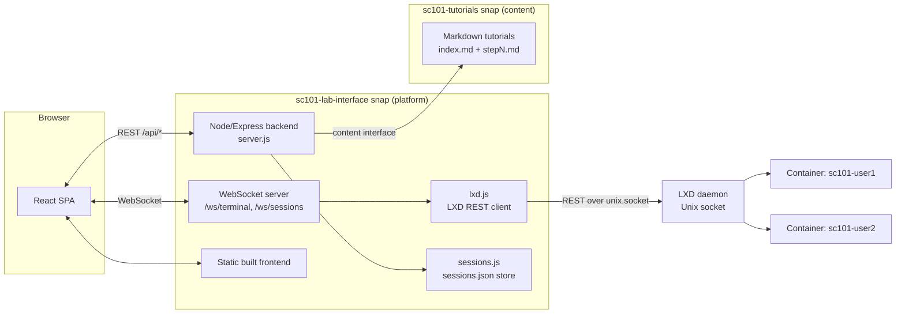

# SC101 Lab Interface — Project Report

> Status snapshot as of **2026-07-03**.
> This report summarizes *what was built, why, and how* — not *how to use it*.
> For usage/setup instructions, see the existing docs (linked throughout, and listed in
> [§ Reference documentation](#reference-documentation)).

---

## 1. Executive summary

SC101 Lab Interface is a KillerCoda-style interactive learning platform: a two-pane web UI
(Markdown tutorial + live terminal) backed by per-user LXD containers, distributed as a pair
of snap packages (platform + content). It grew from a single-user prototype into a
multi-user, teacher/student-capable platform with AI-assisted tutorial authoring, over
**~95 commits** and **35 documented build phases** (see [`genesis.md`](./genesis.md)).

---

## 2. Challenges encountered

The project accumulated a long tail of subtle, hard-to-diagnose bugs, largely because it
integrates several loosely-documented systems (React rendering timing, LXD's CLI/API
behavior, snap confinement, and markdown-to-terminal command extraction). The full list with
root causes and fixes is tracked in [`genesis.md` § Key technical decisions and pitfalls](./genesis.md#key-technical-decisions-and-pitfalls).
Highlights by category:

### Frontend/React timing bugs
- **Double-mounted terminal**: `React.StrictMode` double-invoked effects in dev, opening two
  WebSocket/PTY pairs and stalling the terminal after one keypress — fixed by removing
  `StrictMode`.
- **Stale step index on tutorial switch**: React batches `setStepIndex`/`setMeta` updates,
  so a step-fetch effect could run with new tutorial metadata but a leftover step index,
  crashing `marked()`. Fixed by consolidating all resets into a single effect keyed on
  `tutorialId`.
- **Scroll position not reset** between tutorial steps (overflow container doesn't know
  content was replaced) — fixed with an explicit `scrollTo({ top: 0, behavior: 'instant' })`.
- **`ws.OPEN` vs `WebSocket.OPEN`**: an easy-to-miss JS gotcha — the ready-state constant only
  exists on the class, not the instance.

### LXD/container lifecycle bugs
- `lxc stop` hangs without `--force` on running containers.
- `lxc export` requires `--instance-only` or it demands a stopped container first.
- Under snap confinement, `lxc launch` invoked via Node's `child_process` **always returns
  exit code 1** even on success (a TTY-detection quirk) — fixed by ignoring the exit code and
  polling actual container state instead.
- Eventually the CLI-wrapping approach (`spawnSync('lxc', ...)`) was replaced with a **direct
  LXD REST API client over the Unix socket** (`/var/snap/lxd/common/lxd/unix.socket`) — this
  was necessary to make terminal exec/attach reliable inside the strict-confinement snap
  sandbox, where spawning subprocesses is restricted. See `backend/lxd.js`.

### Snap packaging bugs
- `vanilla-framework` ships SCSS, not compiled CSS — had to load Canonical's CDN build
  instead of `npm install`-ing it.
- `snapcraft` plugin `make` failed ("No rule to make target 'install'") — switched to
  `plugin: nil` + `override-build`.
- Session data corruption / sessions "lost" after container expiry or snap refresh, and a
  `DELETE` endpoint that stopped the container but never removed the session record — both
  fixed in the snap-hardening pass (see `f6045e8`, `684f8f0`, `c0d90c9`, `fcc9864`).
- Tutorial content packaged as a **separate content-interface snap** (`sc101-tutorials`) so
  tutorial packs can be swapped without rebuilding the platform — required careful
  `organize:` rules in `snapcraft.yaml` to land files at the path the backend expects.

### Tutorial-content bugs (encountered *while authoring*, not just building)
- `marked` strips tab characters from fenced code blocks, breaking `Makefile` recipes copied
  via the terminal Run button — fixed by emitting `printf '...\t...'` instead of a heredoc.
- Several "free API" choices for tutorial demos turned out to be unreliable in a sandboxed
  container (HTTPS/SSL issues, JSON APIs returning HTML) and were swapped twice
  (`numbersapi.com` → `icanhazip.com`) before settling on a working plain-HTTP endpoint.
- AppArmor denial inspection inside an LXD container: `journalctl` and later `dmesg` were
  both found to be blocked/unreliable in that environment; settled on `/var/log/syslog`.

### Multi-user / shared-session bugs (most recent phase)
- Correctly classifying a reconnecting user as "teacher" vs "student", avoiding duplicate
  presence badges on rejoin, and making sure `canWrite` permission changes are honored
  instantly *for connections already open* on the shared WebSocket required several
  iterative fixes (`1956e5a`, `7b52d41`, `704cb5b`, `c70ffa6`, `74bb403`).

---

## 3. What has been explored

- **Two backend transport strategies for the terminal**: subprocess-based `lxc exec` (via
  `node-pty`/`spawnSync`) for local development, and a **hand-rolled LXD REST + WebSocket
  client** (`backend/lxd.js`) for the strictly-confined snap runtime, including a minimal
  raw WebSocket handshake over the LXD Unix socket (no external WS client lib needed on that
  path).
- **Tutorial content formats and conversion**: native SC101 format (`index.md` + `stepN.md`
  with YAML frontmatter) vs. KillerCoda format (`index.json` + `intro.md`/`finish.md`), with
  auto-detection and one-way conversion on import (single-tutorial and multi-tutorial repo
  layouts).
- **Import pipeline**: importing a tutorial directly from a GitHub repo URL from the UI,
  including validation, missing-frontmatter auto-fill, and format hardening.
- **Design system integration**: Canonical's Vanilla Framework (CDN-loaded CSS) combined
  with custom `--sc101-*` CSS variables and a light/dark/auto theme system, rather than
  fighting Vanilla's own `--vf-*` variables.
- **Session/UX models**: solo sessions, then persistent per-user sessions, then a
  teacher/student shared-terminal model with join codes, read-only overlays, and live
  presence — explored and iterated across ~20 commits.
- **Snap architecture options**: single monolithic snap vs. platform+content split (chosen,
  to let tutorial packs update independently); CLI-subprocess vs. REST-API access to LXD
  from inside a strictly-confined snap (REST API chosen for reliability).
- **Tutorial UX structuring**: flat list → sectioned list → course/section/tree hierarchy
  with dependency (`requires`) visualization and collapsible course groups.

---

## 4. How AI has been used and driven

This project was built end-to-end through conversational AI pair-programming (GitHub
Copilot / Claude), with the human directing scope and reviewing/steering fixes. Two distinct
AI-usage patterns emerged:

1. **AI as the builder** — nearly every phase in [`genesis.md`](./genesis.md) is a literal
   record of the instruction given to the AI agent and the resulting implementation,
   including root-cause explanations for regressions the AI introduced and then fixed. This
   file is explicitly designed to be **replayable** — it documents *rephrased* instructions
   that avoid the bugs hit the first time around, so the whole app could be rebuilt from
   scratch by feeding `genesis.md` to an agent again.
2. **AI as a content-authoring tool for tutorials** — rather than being a one-off usage of
   AI, tutorial creation itself was turned into a repeatable, portable AI skill:
   - [`tutorials/INSTRUCTIONS.md`](./tutorials/INSTRUCTIONS.md) — the authoritative rulebook
     any human or AI must follow when authoring a tutorial (official-references-only,
     verify tool availability, diff/patch instead of overwrite, atomic steps, concept
     callouts).
   - [`.github/skills/create-lab/SKILL.md`](./.github/skills/create-lab/SKILL.md) — a VS Code
     Copilot **skill** that auto-triggers when asked to convert a raw lab file into a tutorial
     bundle, encoding the workflow (read instructions → extract → split → generate files →
     validate).
   - A derived **Gemini/Claude-portable bundle** (workflow file + a copy of
     `INSTRUCTIONS.md`) so the same authoring capability isn't locked to one AI vendor/tool.

   This means tutorial content creation is itself an AI-driven pipeline: a human supplies a
   raw lab, and an AI agent (any vendor) turns it into a validated, platform-conformant
   tutorial bundle without additional prompting.

For the full, phase-by-phase record of every instruction and fix, see
[`genesis.md`](./genesis.md).

---

## 5. Global final architecture

### Backend (`backend/`)
- **`server.js`** — Express REST API + static frontend hosting + WebSocket upgrade handling.
  Owns tutorial discovery/parsing (`gray-matter` frontmatter), the KillerCoda→SC101 converter,
  the GitHub import endpoint, host-prerequisite checks (`/api/setup/check`), and the shared
  terminal WebSocket protocol (presence, `canWrite` permission enforcement, teaching-session
  broadcast).
- **`lxd.js`** — All container lifecycle and terminal I/O. Talks to LXD **directly over its
  REST API via the Unix socket** (`/var/snap/lxd/common/lxd/unix.socket`), including a
  hand-rolled WebSocket handshake for exec I/O — chosen over shelling out to the `lxc` CLI
  because subprocess spawning is unreliable/restricted under strict snap confinement. Handles
  idle-container auto-stop (5 min) and session expiry (2 h) with container auto-destroy.
- **`sessions.js`** — Session persistence (`data/sessions.json`, atomic writes). Models
  solo sessions and **teaching sessions** with an owner + participants list, per-participant
  role (`teacher`/`student`) and `canWrite` permission, plus join codes for students to attach
  to a shared terminal.

### Frontend (`frontend/`)
- React 18 + Vite SPA. Screen flow: **Login → Tutorial Selector → Tutorial view**, with a
  separate **Teacher Dashboard** (live session list over `/ws/sessions`) for teaching mode.
- `components/TutorialPane` — Markdown rendering (`marked` + DOMPurify + Prism.js), step
  navigation, ▶ Run buttons, finish/next-tutorial flow.
- `components/TerminalPane` — xterm.js bound to the backend WebSocket, presence avatars,
  read-only overlay for students without write permission.
- `components/SettingsPanel` — gear menu: user info/progress, LXC image export/download,
  theme switch, GitHub tutorial import, host-prerequisite status.
- `components/ThemeToggle` — light/dark/auto theme via CSS class + `prefers-color-scheme`.

### Tutorial authoring / agent pipeline
- Tutorials are plain Markdown bundles (`index.md` frontmatter + `stepN.md` files) living
  under `tutorials/<Course>/<tutorial-id>/`, governed by
  [`tutorials/INSTRUCTIONS.md`](./tutorials/INSTRUCTIONS.md).
- New tutorials are produced either by hand, by the **`create-lab` Copilot skill**, or via the
  portable Gemini/Claude bundle — all three follow the same authoring rulebook so output is
  interchangeable.
- Tutorials can also be **imported from a GitHub repo URL** at runtime; the backend
  auto-detects SC101-native vs. KillerCoda (single or multi) format and converts on the fly.

### Snap architecture
Two independently-versioned snaps, connected via the `content` interface:

| Snap | Role | Confinement |
|---|---|---|
| `sc101-lab-interface` | Backend + bundled built frontend, daemon service | `strict`, `base: core24` |
| `sc101-tutorials` | Tutorial Markdown content only | `strict`, `base: core24` |

- Platform snap plugs: `network`, `network-bind`, `lxd` (manual connect required), and a
  custom content plug `sc101-tutorials` mounted at `$SNAP/tutorials`.
- A writable override path (`$SNAP_COMMON/tutorials`) lets operators hot-swap tutorial content
  without rebuilding/reconnecting a content snap.
- Full build/connect/troubleshoot steps are documented in
  [`SNAP_PACKAGING.md`](./SNAP_PACKAGING.md) and [`INSTALL.md`](./INSTALL.md); a machine-
  readable snapshot of the packaging decisions is kept in
  [`snap-analysis.json`](./snap-analysis.json).

---

## Reference documentation

This report intentionally does not duplicate usage instructions. See:

| Topic | Document |
|---|---|
| Full phase-by-phase build history & pitfalls | [`genesis.md`](./genesis.md) |
| Project overview, dev setup, tutorial format | [`README.md`](./README.md) |
| Installing from pre-built snaps | [`INSTALL.md`](./INSTALL.md) |
| Building/packaging the snaps from source | [`SNAP_PACKAGING.md`](./SNAP_PACKAGING.md) |
| Multi-user / teacher-student session testing | [`MULTIUSER_TESTING.md`](./MULTIUSER_TESTING.md) |
| Tutorial authoring rules (human or AI) | [`tutorials/INSTRUCTIONS.md`](./tutorials/INSTRUCTIONS.md) |
| Tutorial format/contributor guide | [`tutorials/README.md`](./tutorials/README.md) |
| AI tutorial-authoring skill | [`.github/skills/create-lab/SKILL.md`](./.github/skills/create-lab/SKILL.md) |
| Machine-readable snap analysis | [`snap-analysis.json`](./snap-analysis.json) |
